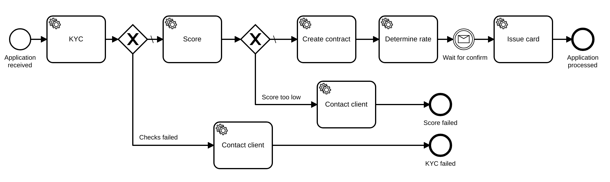

# Zeebe Kafka project

Local environment with Proof of concept workflows implemented.

## Open card



## All components


## Components

  * Zookeeper for Kafka
  * Kafka
  * Kibana
  * Zeebe-simple-monitor
  * Kotlin workers

## Installing and running

```bash
# Add simple monitor project inside 
git clone https://github.com/huksley/zeebe-simple-monitor
cd zeebe-simple-monitor
git checkout custom-schema-mysql
mvn clean package
cd ..

# Download necessary JARs for Zeebe
./gradlew download

# Prepare docker data folders and run docker containers
./fix-perms
docker-compose up -d

# Run workers Kotlin project
cd workers
./gradlew run
```

## Available services

  * Simple Monitor http://localhost:8182
  * Kibana http://localhost:8184
  * Metabase http://localhost:8183

## Commands

**Show all available kafka commands in container**

`./kafka`

**Create kafka topic**

`./kafka kafka-topics.sh --zookeeper zookeeper:2181 --create  --topic test --partitions 1 --replication-factor 1`

**Show information about created topic**

`./kafka kafka-topics.sh --zookeeper zookeeper:2181 --describe --topic test`

**Start test console producer**

Type messages on console (one line - one payload) or pipe them

`./kafka kafka-console-producer.sh --broker-list localhost:9200 --topic test`

**Start test console consumer**

Will output incoming messages - one message per line.

`./kafka kafka-console-consumer.sh --bootstrap-server localhost:9092 --topic test`

**Open monitor MySQL database**

`mysql -h 127.0.0.1 -P 8106 -u zeebe -p123 zeebe`

## Links

  * https://docs.zeebe.io/basics/exporters.html
  * https://forum.zeebe.io/t/simple-monitor-ui/186
  * https://github.com/zeebe-io/zeebe-get-started-java-client


